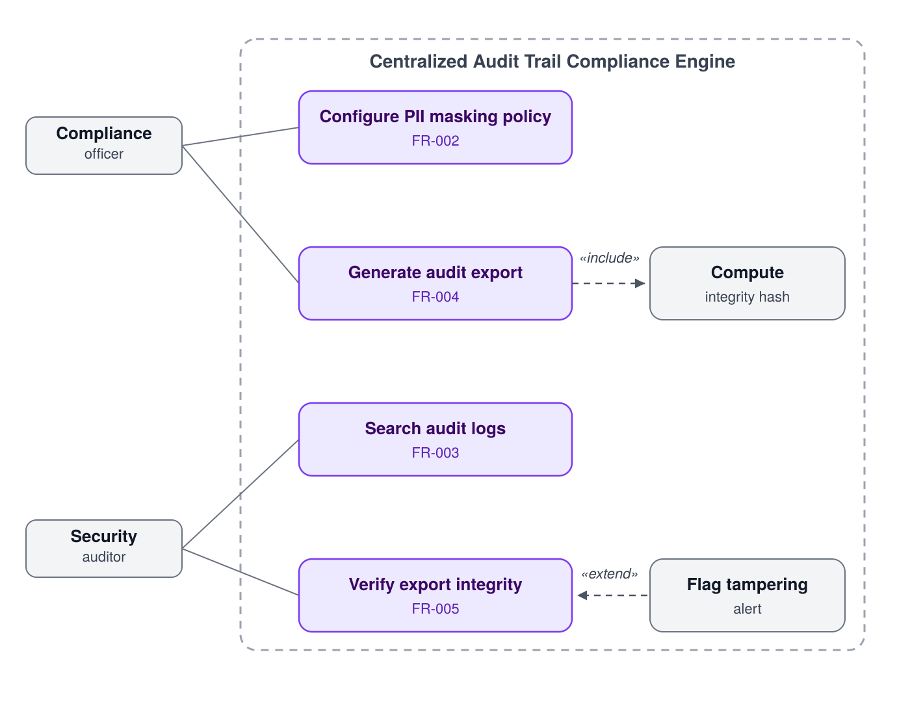

# Centralized Audit Trail Compliance Engine

**Course:** PES University — Dept. of CSE — Software Engineering
**Lab 1:** Requirements Engineering & UML Use-Case Modelling
**Problem Statement #50** | Developer Tools & IT Operations

## Problem Context

A compliance logging platform that ingests enterprise application event logs, masks sensitive PII fields (SSNs, credit card numbers) in accordance with GDPR before persisting them, and generates cryptographically verifiable, immutable audit exports. The system exists to help organizations prove regulatory compliance while giving auditors a trustworthy, tamper-evident record of historical activity.

## Actors

- **Compliance Officer** — configures PII masking policy and generates audit exports for regulators.
- **Security Auditor** — searches historical audit logs and verifies the integrity of generated exports.

## UML Use-Case Diagram

- `Generate Audit Export` **«include»s** `Compute Integrity Hash` — hashing always runs as part of export generation.
- `Flag Tampering Alert` **«extend»s** `Verify Export Integrity` — the alert only fires conditionally, when a tamper check fails.

## Requirements Table

| ID | Type | Description | Priority | Acceptance Criteria | Rationale |
|---|---|---|---|---|---|
| FR-001 | Functional | The system shall parse structured JSON audit logs, identify and mask PII fields (SSNs, credit cards) before persisting records to storage | High | Pass: masked audit log saved with SHA-256 integrity hash; Fail: cleartext credit card number stored in database | GDPR mandates PII minimization at rest |
| FR-002 | Functional | The system shall allow the Compliance Officer to define and edit PII masking rules (field name/pattern to masking strategy) via a configuration interface | High | Pass: new rule applied to next ingested log within 5 minutes; Fail: rule not applied | Masking rules vary by client/regulation and must be configurable, not hardcoded |
| FR-003 | Functional | The system shall allow the Security Auditor to search and filter audit logs by date range, actor ID, event type, and severity | High | Pass: correct result set returned for given filters; Fail: missing or incorrect records | Auditors need targeted investigation, not full-log scanning |
| FR-004 | Functional | The system shall generate a cryptographically signed, immutable export of audit logs for a specified date range | High | Pass: export file generated with verifiable digital signature; Fail: export is unsigned or mutable | Exports serve as legal or regulatory evidence and must be tamper-evident |
| FR-005 | Functional | The system shall verify the integrity of a previously generated export on demand and flag any tampering | Medium | Pass: correctly distinguishes valid vs altered exports; Fail: false positive or false negative | Auditors must be able to trust exports even months after generation |
| NFR-001 | Performance & Security | Audit log query endpoints must support complex filtering across 10 million historical records in under 1 second | High | Benchmarking tests confirm target latency and security standards under simulated peak load | Compliance queries during active audits are time-sensitive |
| NFR-002 | Security | All audit logs must be encrypted at rest (AES-256) and in transit (TLS 1.2+); stored logs must be immutable (WORM storage) | High | Pass: penetration test finds no cleartext exposure and no in-place log edits possible | Regulatory requirement (GDPR Art. 32) — audit logs themselves contain sensitive data |

## Use-Case Flow Specification

**Use Case:** Generate Audit Export
**Actors:** Compliance Officer (primary), Security Auditor (primary)

**Preconditions:**
- User is authenticated and holds the Compliance Officer or Security Auditor role
- At least one masked audit log record exists for the requested date range

**Postconditions:**
- An export file is generated containing masked log records for the specified range
- A SHA-256 integrity hash of the export is computed and stored alongside it
- The export generation event is itself written to the audit log

**Main Success Scenario:**
1. User selects "Generate Export" and specifies a date range and optional filters (actor, event type)
2. System retrieves matching masked audit records from storage
3. System *includes* "Compute Integrity Hash" — generates a SHA-256 hash over the record set
4. System packages records and hash into a signed export file
5. System logs the export action (who, when, what range) as a new audit event
6. System presents a download link to the user

**Alternate Flow — A1: No records found in range**
- At step 2, if zero records match the filter, system displays "No records found for this range" and returns the user to the export form without generating a file. Use case ends without reaching postconditions.

## Author

**Name:K PREKSHA**
**SRN:PES1UG24AM907**
**Section:5D**

